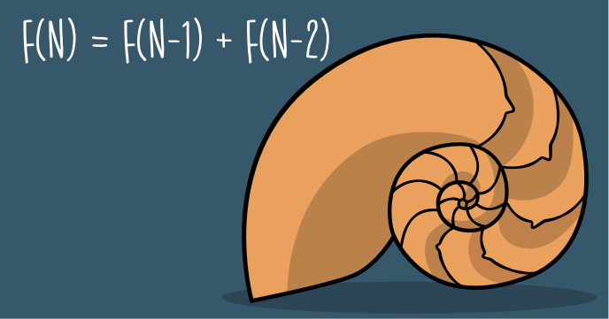

Try to calculate the Fibonacci numbers using a classical algorithm and you’ll see that soon enough numbers will be so big that cannot be represented in normal language structures.

This program shows you how to calculate Fibonacci numbers with hundreds of digits. It doesn’t implement the fastest algorithm but is the easiest to understand.

The user will interact with the program using the keyboard.
 
## Source code 
The JavaScript source code of this program can be found [here](sketches/program.js). To run it, you need to import it in the [codeguppy.com](https://codeguppy.com) online editor. Alternatively, you can use the source code in your p5.js sketches (advanced use). 
## Online version 
To see the code running, check the online playground at [https://codeguppy.com/code.html?t=fibonacci_list](https://codeguppy.com/code.html?t=fibonacci_list) 
## Next steps 
Please check [codeguppy.com](https://codeguppy.com) for many other fun JavaScript programs and games for beginners. To stay up to date with CodeGuppy development please follow [@codeguppy](https://twitter.com/codeguppy) on Twitter.  
